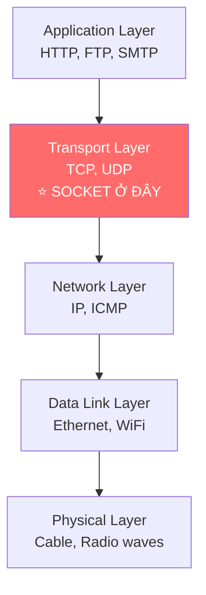
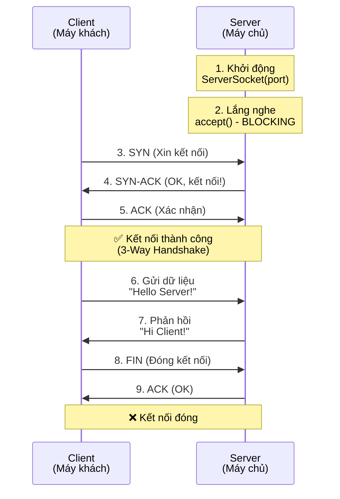

## 🎯 Tại sao bài này khác biệt?

Năm 2024, khi mọi người đang nói về Cloud, Microservices, Kubernetes... thì tại sao chúng ta lại quay về học **Socket** - một công nghệ "cổ lỗ sĩ" từ thập niên 80?

**Câu trả lời:** Bởi vì **mọi thứ bạn dùng hàng ngày đều chạy trên Socket**:
- WhatsApp gửi tin nhắn? → Socket
- Netflix stream phim? → Socket (WebSocket)
- Game online? → Socket
- API call từ app mobile? → Socket (HTTP over TCP)

Nếu không hiểu Socket, bạn chỉ đang "copy-paste code" mà không biết **tại sao** nó hoạt động. Bài viết này sẽ thay đổi điều đó.

> 💡 **Mục tiêu**: Sau 30 phút đọc bài này, bạn sẽ tự tay code được một **Chat Application** hoàn chỉnh, hiểu rõ cách TCP hoạt động, và biết cách debug khi có lỗi.

---

## 📖 Câu chuyện thực tế: Lần đầu tôi "phá" production

Năm 2019, khi còn là intern, tôi được giao task "đơn giản": Viết một service nhận file upload từ mobile app. Tôi nghĩ: "Dễ mà, chỉ cần `ServerSocket.accept()` rồi đọc `InputStream`".

**Kết quả?** Sau 2 tuần deploy, production server **đột ngột crash** vào 2h sáng. Nguyên nhân: Tôi quên đóng Socket sau khi xử lý xong, dẫn đến **memory leak**. Sau 10,000 connections, server hết RAM.

Bài học đắt giá: **Socket không chỉ là code, mà là quản lý tài nguyên hệ thống**. Hãy cùng học cách làm đúng ngay từ đầu.

---

## 1. Socket là gì? (Giải thích như bạn 5 tuổi)

Hãy tưởng tượng bạn muốn gửi thư cho bạn bè:

```
Bạn (Client) → Bưu điện (Network) → Nhà bạn bè (Server)
```

**Socket** chính là "hòm thư" ở hai đầu:
- **Client Socket**: Hòm thư nhà bạn (để gửi thư đi)
- **Server Socket**: Hòm thư nhà bạn bè (để nhận thư)

Mỗi "hòm thư" cần 2 thông tin:
1. **Địa chỉ nhà** (IP Address): Ví dụ `192.168.1.100`
2. **Số phòng** (Port Number): Ví dụ `8080`

### 1.1. Kiến trúc TCP/IP Stack

Socket hoạt động ở **tầng Transport** (Layer 4) trong mô hình OSI:



### 1.2. TCP vs UDP: Chọn gì?

| Tiêu chí | TCP (Stream Socket) | UDP (Datagram Socket) |
|----------|---------------------|----------------------|
| **Đảm bảo dữ liệu** | ✅ 100% đến đích | ❌ Có thể mất gói tin |
| **Thứ tự** | ✅ Đúng thứ tự gửi | ❌ Có thể đảo lộn |
| **Tốc độ** | 🐢 Chậm hơn (overhead) | 🚀 Nhanh hơn |
| **Use case** | Chat, Email, File transfer | Streaming, Gaming, VoIP |

**Bài này tập trung vào TCP** - phù hợp cho 90% ứng dụng.

---

## 2. Mô hình Client-Server: Ai làm gì?

### 2.1. Sơ đồ tổng quan



### 2.2. Vai trò của Server

Server giống như **quầy lễ tân khách sạn**:
1. **Luôn sẵn sàng** (24/7 listening)
2. **Chờ khách đến** (`accept()` blocking)
3. **Phục vụ từng khách** (xử lý request)
4. **Có thể phục vụ nhiều khách cùng lúc** (multi-threading)

### 2.3. Vai trò của Client

Client giống như **khách hàng**:
1. **Chủ động tìm đến** (connect to server)
2. **Đặt yêu cầu** (send request)
3. **Nhận kết quả** (receive response)
4. **Rời đi khi xong** (close connection)

---

## 3. Code thực chiến: Xây dựng Chat App

### 3.1. Server: Quầy lễ tân chờ khách

```java
import java.io.*;
import java.net.*;
import java.time.LocalDateTime;
import java.time.format.DateTimeFormatter;

/**
 * Simple Chat Server - Phiên bản Production-Ready
 * 
 * Improvements:
 * - Try-with-resources để tự động đóng socket
 * - Logging với timestamp
 * - Error handling chi tiết
 * - Graceful shutdown
 */
public class ChatServer {
    private static final int PORT = 1234;
    private static final DateTimeFormatter TIME_FORMAT = 
        DateTimeFormatter.ofPattern("HH:mm:ss");
    
    public static void main(String[] args) {
        log("🚀 Chat Server starting...");
        
        try (ServerSocket serverSocket = new ServerSocket(PORT)) {
            log("✅ Server listening on port " + PORT);
            log("💡 Waiting for client connection...");
            
            // BLOCKING CALL - Chờ client kết nối
            Socket clientSocket = serverSocket.accept();
            
            // Lấy thông tin client
            String clientIP = clientSocket.getInetAddress().getHostAddress();
            int clientPort = clientSocket.getPort();
            log("🎉 Client connected from " + clientIP + ":" + clientPort);
            
            // Setup I/O streams
            BufferedReader in = new BufferedReader(
                new InputStreamReader(clientSocket.getInputStream())
            );
            PrintWriter out = new PrintWriter(
                clientSocket.getOutputStream(), 
                true  // auto-flush = true
            );
            
            // Main communication loop
            String message;
            while ((message = in.readLine()) != null) {
                log("📩 Received: " + message);
                
                // Echo back với timestamp
                String response = "[" + getCurrentTime() + "] Server received: " + message;
                out.println(response);
                log("📤 Sent: " + response);
                
                // Exit condition
                if (message.equalsIgnoreCase("bye")) {
                    log("👋 Client requested disconnect");
                    break;
                }
            }
            
            // Cleanup
            clientSocket.close();
            log("🔒 Connection closed");
            
        } catch (IOException e) {
            error("❌ Server error: " + e.getMessage());
            e.printStackTrace();
        }
        
        log("🛑 Server shutdown");
    }
    
    // Utility methods
    private static void log(String message) {
        System.out.println("[" + getCurrentTime() + "] " + message);
    }
    
    private static void error(String message) {
        System.err.println("[" + getCurrentTime() + "] " + message);
    }
    
    private static String getCurrentTime() {
        return LocalDateTime.now().format(TIME_FORMAT);
    }
}
```

### 3.2. Client: Khách hàng gửi tin nhắn

```java
import java.io.*;
import java.net.*;
import java.util.Scanner;

/**
 * Simple Chat Client - Interactive Version
 * 
 * Features:
 * - Interactive console input
 * - Real-time messaging
 * - Clean error handling
 */
public class ChatClient {
    private static final String SERVER_ADDRESS = "localhost";
    private static final int SERVER_PORT = 1234;
    
    public static void main(String[] args) {
        System.out.println("=== Chat Client ===");
        System.out.println("Connecting to " + SERVER_ADDRESS + ":" + SERVER_PORT + "...");
        
        try (
            Socket socket = new Socket(SERVER_ADDRESS, SERVER_PORT);
            PrintWriter out = new PrintWriter(socket.getOutputStream(), true);
            BufferedReader in = new BufferedReader(
                new InputStreamReader(socket.getInputStream())
            );
            Scanner scanner = new Scanner(System.in)
        ) {
            System.out.println("✅ Connected! Type 'bye' to exit.\n");
            
            String userInput;
            while (true) {
                // Get user input
                System.out.print("You: ");
                userInput = scanner.nextLine();
                
                // Send to server
                out.println(userInput);
                
                // Exit condition
                if (userInput.equalsIgnoreCase("bye")) {
                    System.out.println("👋 Disconnecting...");
                    break;
                }
                
                // Receive response
                String response = in.readLine();
                System.out.println("Server: " + response + "\n");
            }
            
        } catch (UnknownHostException e) {
            System.err.println("❌ Cannot find server: " + e.getMessage());
        } catch (IOException e) {
            System.err.println("❌ Connection error: " + e.getMessage());
            e.printStackTrace();
        }
        
        System.out.println("✅ Client closed");
    }
}
```

### 3.3. Chạy thử nghiệm

**Terminal 1 (Server):**
```bash
$ javac ChatServer.java
$ java ChatServer
[14:30:15] 🚀 Chat Server starting...
[14:30:15] ✅ Server listening on port 1234
[14:30:15] 💡 Waiting for client connection...
[14:30:20] 🎉 Client connected from 127.0.0.1:54321
[14:30:25] 📩 Received: Hello Server!
[14:30:25] 📤 Sent: [14:30:25] Server received: Hello Server!
```

**Terminal 2 (Client):**
```bash
$ javac ChatClient.java
$ java ChatClient
=== Chat Client ===
Connecting to localhost:1234...
✅ Connected! Type 'bye' to exit.

You: Hello Server!
Server: [14:30:25] Server received: Hello Server!

You: How are you?
Server: [14:30:30] Server received: How are you?

You: bye
👋 Disconnecting...
✅ Client closed
```

---

## 4. Deep Dive: Những điều "ẩn" bên dưới

### 4.1. `accept()` - Blocking Call nguy hiểm

```java
Socket client = serverSocket.accept(); // ⚠️ BLOCKING!
```

**Vấn đề:** Nếu không có client kết nối, chương trình sẽ **"đóng băng"** tại dòng này mãi mãi.

**Giải pháp:**
```java
// Set timeout 30 giây
serverSocket.setSoTimeout(30000);

try {
    Socket client = serverSocket.accept();
} catch (SocketTimeoutException e) {
    System.out.println("No client connected within 30s");
}
```

### 4.2. Try-with-resources: Tại sao quan trọng?

**❌ Code tệ (Memory Leak):**
```java
Socket socket = new Socket("localhost", 1234);
// ... làm việc với socket ...
// QUÊN ĐÓNG → Memory Leak!
```

**✅ Code tốt (Auto-close):**
```java
try (Socket socket = new Socket("localhost", 1234)) {
    // ... làm việc với socket ...
} // Tự động đóng khi ra khỏi block
```

### 4.3. Buffer Size: Ảnh hưởng đến Performance

```java
// Mặc định: 8KB buffer
BufferedReader in = new BufferedReader(
    new InputStreamReader(socket.getInputStream())
);

// Custom: 64KB buffer (tốt cho file lớn)
BufferedReader in = new BufferedReader(
    new InputStreamReader(socket.getInputStream()),
    65536  // 64KB
);
```

---

## 5. Troubleshooting: Lỗi thường gặp

### 5.1. `java.net.BindException: Address already in use`

**Nguyên nhân:** Port đã được process khác sử dụng.

**Cách fix:**
```bash
# Windows: Tìm process đang dùng port 1234
netstat -ano | findstr :1234
taskkill /PID <process_id> /F

# Linux/Mac
lsof -i :1234
kill -9 <PID>
```

**Hoặc dùng port khác:**
```java
private static final int PORT = 5678; // Thay đổi port
```

### 5.2. `java.net.ConnectException: Connection refused`

**Nguyên nhân:** Server chưa chạy hoặc firewall chặn.

**Checklist:**
1. ✅ Server đã chạy chưa?
2. ✅ Port đúng chưa?
3. ✅ Firewall có chặn không?
4. ✅ IP address đúng chưa? (`localhost` vs `127.0.0.1` vs IP thật)

### 5.3. `java.net.SocketTimeoutException: Read timed out`

**Nguyên nhân:** Client/Server không gửi dữ liệu trong thời gian timeout.

**Giải pháp:**
```java
socket.setSoTimeout(10000); // 10 giây timeout
```

---

## 6. Best Practices: Làm sao cho "Pro"?

### ✅ DO (Nên làm)

1. **Luôn dùng try-with-resources**
   ```java
   try (Socket socket = new Socket(...)) { }
   ```

2. **Set timeout để tránh blocking vô hạn**
   ```java
   socket.setSoTimeout(30000);
   ```

3. **Log đầy đủ để debug**
   ```java
   System.out.println("[" + timestamp + "] " + message);
   ```

4. **Xử lý exception cụ thể**
   ```java
   catch (SocketTimeoutException e) { }
   catch (IOException e) { }
   ```

### ❌ DON'T (Không nên)

1. **Không đóng socket**
   ```java
   Socket socket = new Socket(...);
   // ... quên close() → Memory Leak!
   ```

2. **Không set timeout**
   ```java
   serverSocket.accept(); // Chờ mãi mãi!
   ```

3. **Catch Exception quá chung**
   ```java
   catch (Exception e) { } // Quá chung chung!
   ```

---

## 7. Next Steps: Nâng cấp lên Production

Code trên chỉ phục vụ **1 client**. Để xây dựng app thực tế:

### 7.1. Multi-threading (Bài tiếp theo)
```java
while (true) {
    Socket client = serverSocket.accept();
    new Thread(() -> handleClient(client)).start();
}
```

### 7.2. Protocol Design
```java
// Định nghĩa message format
{
  "type": "chat",
  "from": "user123",
  "message": "Hello!",
  "timestamp": 1640000000
}
```

### 7.3. Security (SSL/TLS)
```java
SSLServerSocketFactory ssf = (SSLServerSocketFactory) 
    SSLServerSocketFactory.getDefault();
SSLServerSocket serverSocket = (SSLServerSocket) 
    ssf.createServerSocket(1234);
```

---

## 8. Ứng dụng thực tế

Socket được dùng ở đâu?

| Ứng dụng | Công nghệ | Socket Type |
|----------|-----------|-------------|
| **WhatsApp** | XMPP Protocol | TCP Socket |
| **Zoom** | WebRTC | UDP Socket |
| **MySQL Client** | MySQL Protocol | TCP Socket |
| **Game Online** | Custom Protocol | UDP + TCP |
| **Web Browser** | HTTP/HTTPS | TCP Socket |

---

## Kết luận

Chúc mừng! 🎉 Bạn vừa học được:

✅ Socket là gì và tại sao quan trọng  
✅ Mô hình Client-Server hoạt động như thế nào  
✅ Code một Chat App hoàn chỉnh  
✅ Debug các lỗi thường gặp  
✅ Best practices để code "như pro"  

**Challenge:** Hãy thử mở rộng Chat App này để:
1. Hỗ trợ nhiều client (multi-threading)
2. Lưu lịch sử chat vào file
3. Thêm username cho mỗi client

Trong bài tiếp theo, chúng ta sẽ học **Multi-threading Socket** để xử lý hàng nghìn client đồng thời!

---

## Tài liệu tham khảo

📚 **Chính thức:**
- [Oracle Java Networking Tutorial](https://docs.oracle.com/javase/tutorial/networking/)
- [RFC 793: TCP Specification](https://www.rfc-editor.org/rfc/rfc793)

📖 **Sách hay:**
- "Java Network Programming" - Elliotte Rusty Harold
- "Computer Networking: A Top-Down Approach" - Kurose & Ross

🎥 **Video:**
- [Hussein Nasser - TCP Deep Dive](https://www.youtube.com/c/HusseinNasser-software-engineering)

💬 **Cộng đồng:**
- [Stack Overflow - Java Socket Tag](https://stackoverflow.com/questions/tagged/java+socket)
- [r/java](https://reddit.com/r/java)

---

*Bài viết được viết bởi Trần Thanh Thiện - Student @ HCMUTE*  
*📧 Có câu hỏi? Hãy comment bên dưới hoặc liên hệ qua email!*